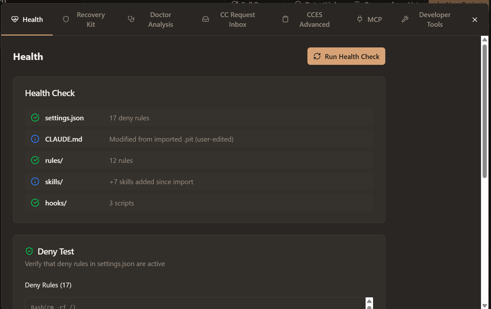
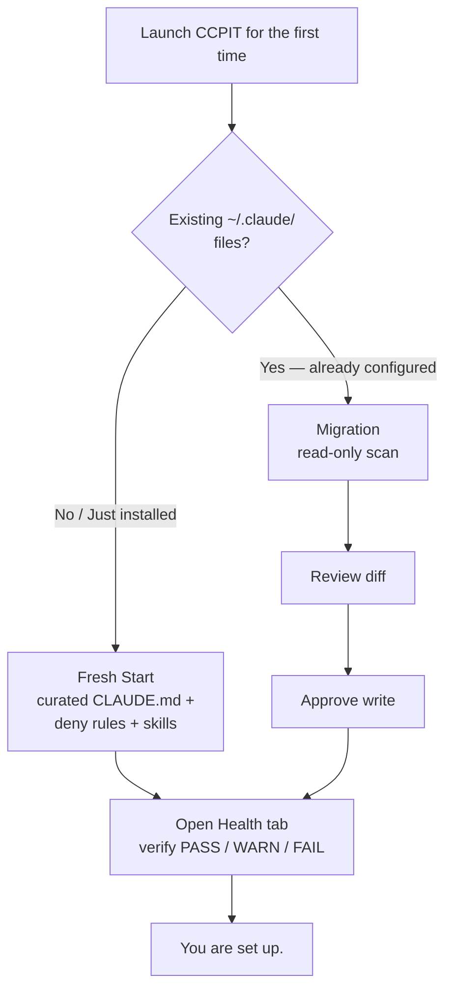
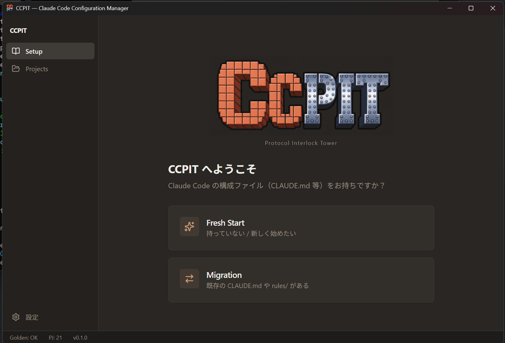
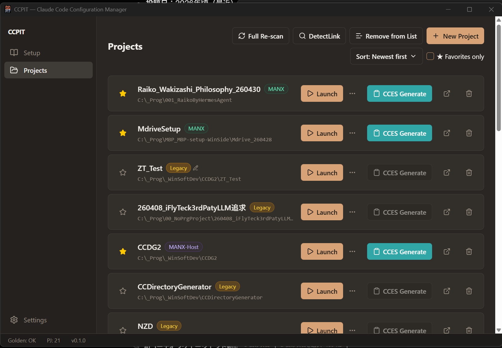
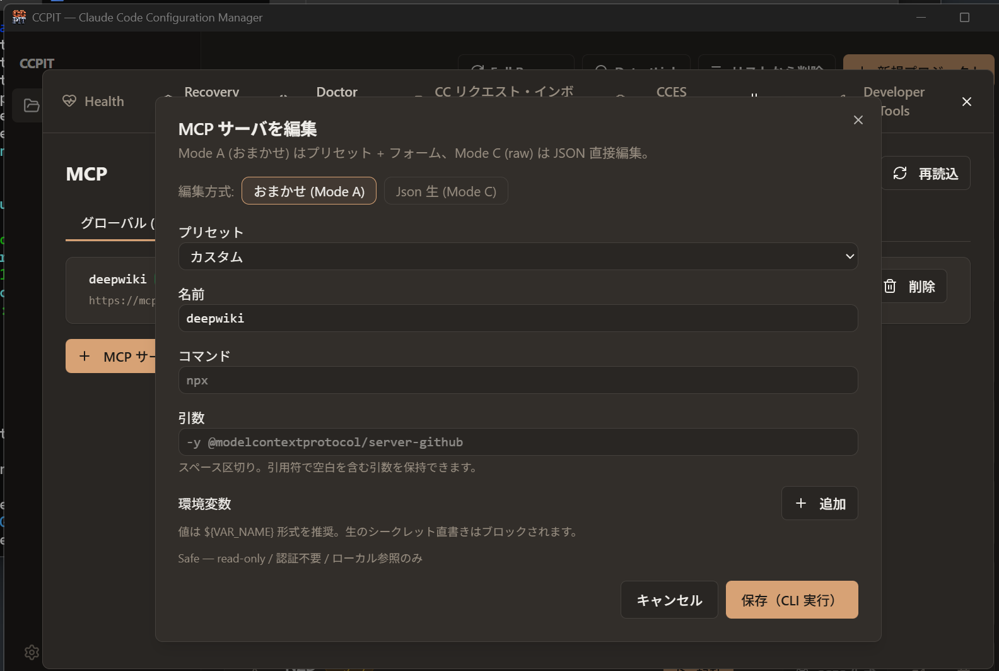

<p align="center">
  
</p>

# CCPIT — Protocol Interlock Tower

> 🇺🇸 **[English README](./README.md)**

[](./package.json)
[](./LICENSE)
[](https://www.electronjs.org/)
[](#クイックスタート)
[](#コンセプト)

**Claude Code の設定を、JSON を直接触らずに管理するためのデスクトップアプリ。**
`~/.claude/` 配下の整合性確認・修復・スナップショット・チーム共有・MCP サーバ管理まで、すべて GUI で完結する。



---

## なぜ CCPIT か

Claude Code を数週間以上使い込んだことがあれば、こんな経験があるはず:

| よくある困りごと | CCPIT の答え |
|---|---|
| `~/.claude/settings.json` がいつの間にか肥大化、どの `deny` ルールが効いているか分からない | Health タブで deny 数を可視化、参照されていない孤立ルールを検出 |
| hook と skill と CLAUDE.md ルールがどこかで矛盾している気がする | Health + Doctor Analysis が rules / skills / hooks / CLAUDE.md frontmatter を相互チェック |
| 設定を壊した。昨日の状態に戻したい | Recovery Kit が名前付きスナップショットを取得、ワンクリック復旧 |
| MCP サーバに write API を持つやつを入れたが、暴走しないか不安 | MCP タブが各サーバを Safe / Caution / Strict に自動分類、write 系ツールはデフォルトで disable |
| チームに同じ Claude Code 設定を配布したい | Golden Bundle が設定一式をパスワード保護 `.pit` ファイルにエクスポート、相手は同じ UI からインポート |
| 複数 PJ を行き来していて、どれがどれだか分からない | Projects が CC プロジェクトを自動検出し、プロトコル種別（MANX / ASAMA / Macau / Legacy）バッジで識別 |

CCPIT は Claude Code のラッパーではない。Claude Code の隣に立って、設定面の世話をするツール。本来の作業に集中するための土台。

---

## とりあえず触ってみたい人へ

「CCPIT、聞いたことあるから一度入れてみるか」という人向けの、初回起動の道案内。`~/.claude/` の中身、hook、skill といった単語を最初に理解する必要はない。触りながら覚える設計になっていて、すべての書込前に Recovery Kit のスナップショットが自動取得されるので、後から戻せる。

### 0 から動く設定までの 3 ステップ

1. **インストール & 起動。** [Releases](https://github.com/VTRiot/ccpit-win/releases) から最新の `CCPIT-Setup-x.y.z.exe` をダウンロード、インストーラを実行し、デスクトップに作成される **CCPIT** ショートカットをダブルクリック（またはスタートメニューの CCPIT から起動）。アプリは Setup 画面から立ち上がる。ソースから動かしたい場合は下の [クイックスタート](#クイックスタート) を参照。
2. **スタート地点を選ぶ。** Setup の Welcome 画面で 1 つだけ聞かれる — *Claude Code の構成ファイル (CLAUDE.md / rules/ 等) をすでに持っているか?*
   - **持っていない / Claude Code を入れたばかり** → **Fresh Start** を選ぶ。クリーンな `CLAUDE.md` テンプレート、推奨 deny ルール、推奨 skill 一式、初期 Recovery Kit スナップショットが配置される
   - **すでに自分で構成済み** → **Migration** を選ぶ。CCPIT がまず *read-only* でスキャンし、差分を提示。承認するまで一切書込しない
3. **Health で確認。** Setup が終わったら Maintenance ダイアログの Health タブを開く。`settings.json` / `CLAUDE.md` / `rules/` / `skills/` / `hooks/` の 5 行が緑チェックで揃っていれば成功。緑でない項目はインライン解説 + (該当する場合) ワンクリック修復が表示される



### 困った時 — このリポを Claude.ai のチャットボット化

CCPIT 専用のヘルプアシスタントを数分で立ち上げられる:

1. <https://claude.ai> で新規 Project を作成 (名前は何でも、*CCPIT Help* 等)
2. 本リポを Project knowledge として連携。一番楽なのは GitHub 連携で <https://github.com/VTRiot/ccpit-win> を指定する方法。手動で行く場合は `README.md` / `README.ja.md` / `docs/help-prompt.md` および `docs/ai-guides/` の中身をアップロード
3. Project の **Custom Instructions** に [`docs/help-prompt.md`](./docs/help-prompt.md) のシステムプロンプトを貼付

これで「Recovery Kit ってなに?」「Fresh Start と Migration どっち選べばいい?」のような質問に、本リポのドキュメントの範囲内で日本語/英語どちらでも答えてくれる Project が完成する。

---

## 主な機能

### Setup（初期セットアップ）



初回起動時の Wizard は 2 分岐:

- **Fresh Start** — クリーンな `CLAUDE.md` テンプレート、推奨 deny ルール、推奨 skill 一式、ロールバック用の Recovery Kit スナップショットを設置
- **Migrate Existing** — 既存の `~/.claude/` を read-only でスキャンし、差分を提示。承認するまで一切書き込まない

Settings からいつでも再実行可能。

### Health & Diagnostics（健全性診断）

- **Health** — `settings.json` / `CLAUDE.md` / `rules/` / `skills/` / `hooks/` を横断で約 17 項目チェック。PASS / WARN / FAIL を集計し、該当箇所をインライン表示
- **Doctor Analysis** — 不具合報告や Claude への状況説明に添付できる「doctor pack」を生成
- **CLI 検出** — `claude` が `PATH` に存在するかとバージョンを確認

### Project Management（プロジェクト管理）



- **DetectLink** — ディスク上の Claude Code プロジェクトを自動検出、プロトコルバッジ（MANX / ASAMA / Macau / Legacy）で識別
- **Favorites** — よく使う PJ をピン留め
- **Protocol History** — その PJ がどのプロトコル rev を経てきたかの履歴表示
- **CC Launch Button** — 正しい PJ ディレクトリでワンクリック Claude Code 起動
- **CC Request Inbox** — Claude Code から「設定をこう変えたい」とリクエストが届くと、ここに溜まる。GUI で承認/却下、JSON 直接編集不要

### Configuration & Distribution（設定の配布）

- **CCES (Claude Code Extensions Summary)** — 現在の設定一式を Markdown スナップショット化。新しい会話への貼付・チーム共有・リポへのコミットに使える
- **Recovery Kit** — `~/.claude/` 全体の名前付きスナップショット。任意の過去状態にワンクリック復旧
- **Golden Bundle** — settings + rules + skills をパスワード保護 `.pit` アーカイブにパッケージ。受領側は同じ UI からインポート
- **i18n** — 日本語 / 英語の完全 UI 対応

### MCP Server Management ★（最新の目玉機能）

MCP サーバを使い始めたチーム向け。「うっかり write 権限を渡してしまった」を構造的に防ぐ設計。

| 機能 | 効用 |
|---|---|
| **2 スコープ管理** | グローバル `~/.claude.json` とプロジェクト `.mcp.json` を同じタブで編集 |
| **Mode A — おまかせ** | プリセット（DeepWiki / GitHub 等）を選ぶと、必要な tool だけ enable、write API はデフォルト disable |
| **Mode C — raw JSON** | CodeMirror 構文ハイライト付きの JSON 直接編集。完全制御したい時 |
| **リスクバッジ** | env の認証情報と write 系 tool キーワードを自動判定し、Safe（緑）/ Caution（黄）/ Strict（赤）の 3 段階で表示 |
| **PAT 直書きガード** | env 値が `${VAR_NAME}` 形式かバリデート、生 token を検出したら保存ブロック |
| **CLI 不在検出** | `claude` CLI が見つからない場合は UI 全体に注意バナー、書込系を全 disable |



---

## クイックスタート

### パッケージ済みインストーラから導入（推奨）

1. [Releases](https://github.com/VTRiot/ccpit-win/releases) から `CCPIT-Setup-x.y.z.exe` をダウンロード
2. インストーラを実行（ユーザー単位インストール対応、インストール先選択可能）
3. デスクトップの **CCPIT** ショートカットまたはスタートメニューから起動

署名付き Windows バイナリ（NSIS）。デフォルトでデスクトップ / スタートメニューにショートカットを作成。

### ソースから起動

前提: Node.js 20+, npm, Git, `claude` CLI が `PATH` 上に存在すること

```bash
git clone https://github.com/VTRiot/ccpit-win.git
cd ccpit-win
npm install
npm run dev
```

起動すると Setup Wizard が立ち上がる。既存の `~/.claude/` がある場合は **Migrate Existing** を選択 — read-only スキャンとスナップショット取得を経てから書き込み確認に進む。

### Windows バイナリのビルド

```bash
npm run build:win
```

`dist/` 配下に unpacked app が生成される。

### その他のコマンド

```bash
npm run typecheck   # TypeScript 型検査（Node + Web）
npm run lint        # ESLint
npm test            # Vitest
```

---

## アーキテクチャ

CCPIT は Electron アプリ:

- **Main process** (`src/main/`) — ファイルシステム、CLI 呼出、設定パース
- **Preload** (`src/preload/`) — 型付き IPC ブリッジ
- **Renderer** (`src/renderer/`) — React 19 + Tailwind 4 + shadcn 系 UI、i18next で多言語化

設定ファイルは Claude Code が期待する場所（`~/.claude/`, `~/.claude.json`, `{project}/.mcp.json`）にそのまま置く。CCPIT はそれらを直接読み書き — 二重管理しない。

破壊的書込（削除・MCP サーバ変更）は手動でも使う `claude` CLI 経由で実行するため、CLI 挙動と完全に一致する。CLI が対応しない編集（`disabledTools` 等）はスナップショット取得後に直接 JSON 書込。

---

## コンセプト

CCPIT は二層 AI 開発パターンを前提に設計されている:

- **設計側 AI**（チャットツール）が要件・指示書・レビュープロンプトを起草
- **実装側 AI**（Claude Code）がその指示書を元に実リポジトリで実装

この分業を機能させるには「どのルールが効いているか／どの skill がロードされているか／何が書込許可されていて何が禁止か」のガバナンスが要る。CCPIT はそのガバナンスを **JSON の山に埋もれさせず可視化・編集可能にする** ためのツール。バッジに記載の `MANX Protocol` は本プロジェクト自身がそれに沿って開発されている規律 — 公開資料は [`docs/ai-guides/`](./docs/ai-guides) を参照。

二層 AI を採用しないユーザーでも、Health と Recovery Kit だけでも価値がある作りになっている。

---

## ロードマップ（現時点）

実装済み:

- Setup Wizard（Fresh / Migrate）
- Projects 自動検出 + Favorites + プロトコルバッジ
- Health + Doctor Analysis
- Recovery Kit
- CCES エクスポート
- Golden Bundle（`.pit`）インポート / エクスポート
- CC Request Inbox
- MCP サーバ管理（Mode A/C、2 スコープ、リスクバッジ）
- 日本語 / 英語 UI
- パッケージ済み Windows インストーラ（署名付き NSIS、Releases から入手可能）

設計検討中（リリース時期未確定、約束しない）:

- macOS / Linux ビルド
- MCP の追加編集モード
- 設定変更の監査ログ

---

## 使用技術

- [Electron](https://www.electronjs.org/) 39 + [electron-vite](https://electron-vite.org/)
- [React](https://react.dev/) 19, [TypeScript](https://www.typescriptlang.org/) 5.9
- [Tailwind CSS](https://tailwindcss.com/) 4 + shadcn 系 UI primitive（[Radix](https://www.radix-ui.com/)）
- [i18next](https://www.i18next.com/)（日本語 / 英語）
- [CodeMirror](https://codemirror.net/)（MCP raw JSON エディタ）
- [adm-zip](https://github.com/cthackers/adm-zip)（Golden Bundle `.pit` 圧縮）
- [lucide-react](https://lucide.dev/) アイコン

---

## Debug Toolkit（同梱 skill）

CCPIT は `golden/common/` 配下に `debug-toolkit` という Claude Code skill を同梱している。アプリの既知失敗モードを症状検索可能なカタログ形式（FMA: Failure Mode Analysis）で記録したもの。CCPIT 自身を Claude Code でデバッグする際、不具合・予期せぬ挙動の観測時に自動発火し、原因候補・検証手順・FM 別の戒めを提示する。意図的に「育てるツールボックス」として作られている — 拡張提案歓迎。

- 日本語（正本）: `golden/common/ja/skills/debug-toolkit/SKILL.md`
- 英語: `golden/common/en/skills/debug-toolkit/SKILL.md`

---

## Contributing

Issue と Pull Request 歓迎。PR 送付前に:

1. `npm run typecheck && npm run lint && npm test` を実行
2. 変更スコープを絞る — 1 PR 1 関心事
3. ガバナンス領域（settings / hooks / deny ルール）に触る場合、Recovery Kit スナップショット戦略を PR 説明に含める

---

## License

MIT. [LICENSE](./LICENSE) 参照。

---

<details>
<summary>クルー</summary>

<br>


</details>
