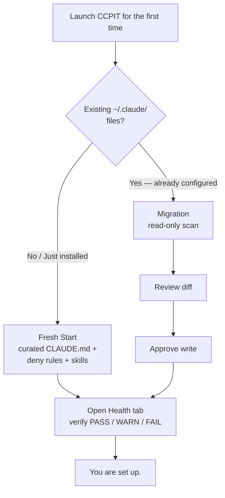
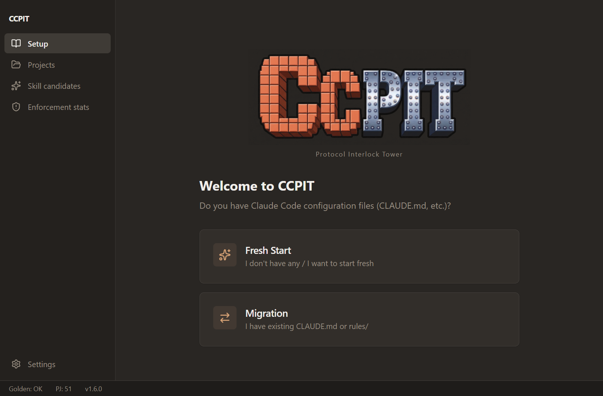
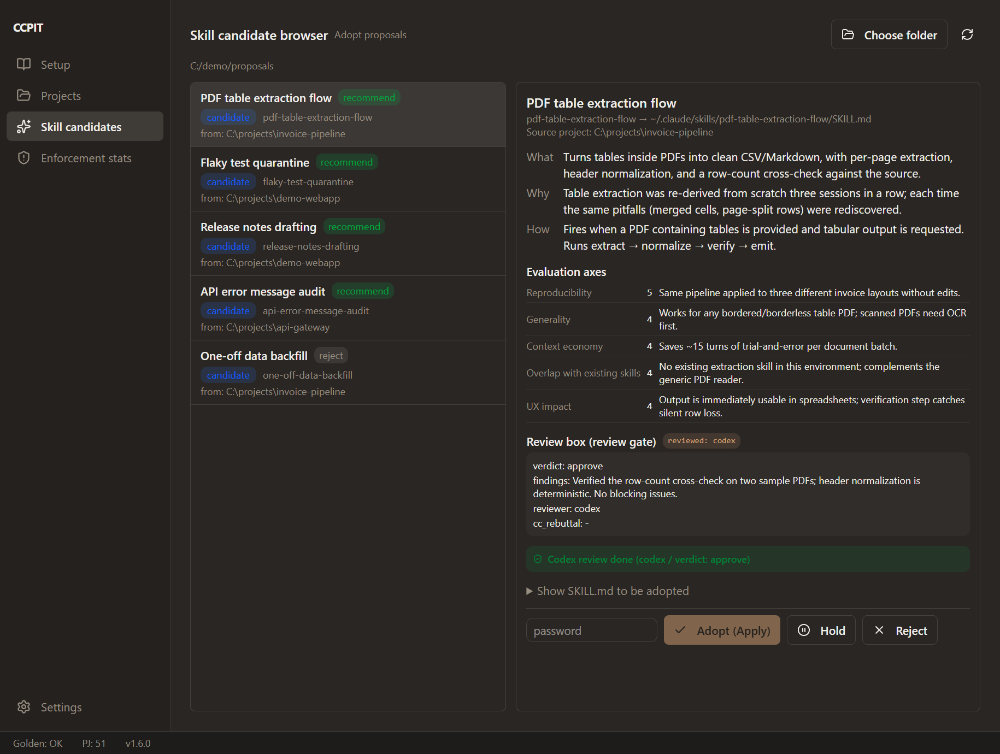
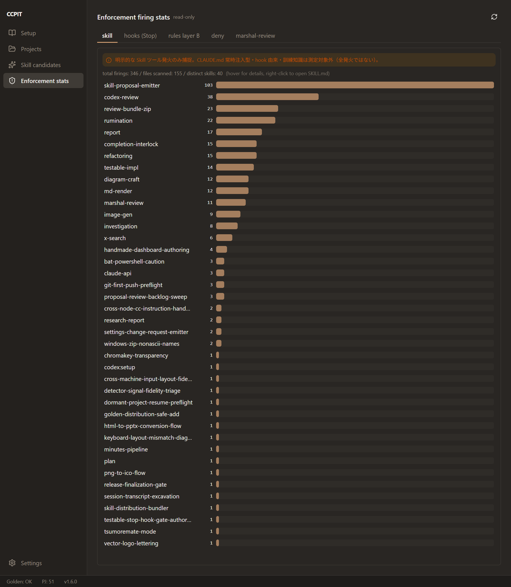
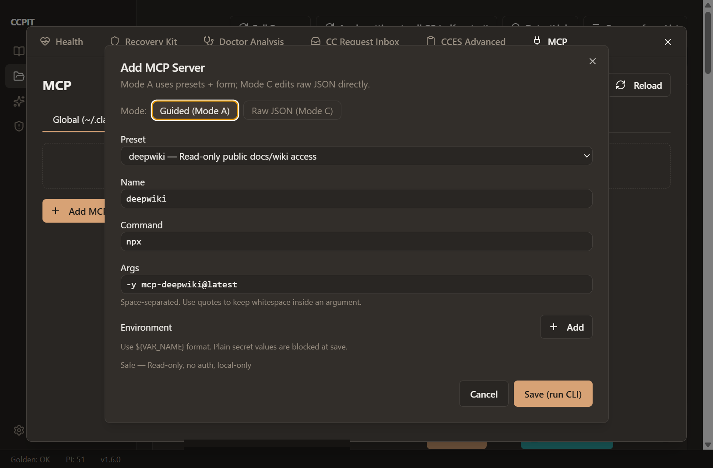

<p align="center">
  
</p>

# CCPIT — Protocol Interlock Tower

> 🇺🇸 **[English README](./README.md)**

[](./package.json)
[](./LICENSE)
[](https://www.electronjs.org/)
[](#クイックスタート)
[](#コンセプト)

**Claude Code の設定を、JSON を直接触らずに管理するためのデスクトップアプリ。**
`~/.claude/` 配下の整合性確認・修復・スナップショット・チーム共有・MCP サーバ管理まで、すべて GUI で完結する。


---

## なぜ CCPIT か

Claude Code を数週間以上使い込んだことがあれば、こんな経験があるはず:

| よくある困りごと | CCPIT の答え |
|---|---|
| `~/.claude/settings.json` がいつの間にか肥大化、どの `deny` ルールが効いているか分からない | Health タブで deny 数を可視化、参照されていない孤立ルールを検出 |
| hook と skill と CLAUDE.md ルールがどこかで矛盾している気がする | Health + Doctor Analysis が rules / skills / hooks / CLAUDE.md frontmatter を相互チェック |
| 設定を壊した。昨日の状態に戻したい | Recovery Kit が名前付きスナップショットを取得、ワンクリック復旧 |
| MCP サーバに write API を持つやつを入れたが、暴走しないか不安 | MCP タブが各サーバを Safe / Caution / Strict に自動分類、write 系ツールはデフォルトで disable |
| チームに同じ Claude Code 設定を配布したい | Golden Bundle が設定一式をパスワード保護 `.pit` ファイルにエクスポート、相手は同じ UI からインポート |
| 複数 PJ を行き来していて、どれがどれだか分からない | Projects が CC プロジェクトを自動検出し、プロトコル種別（MANX / ASAMA / Macau / Legacy）バッジで識別 |

CCPIT は Claude Code のラッパーではない。Claude Code の隣に立って、設定面の世話をするツール。本来の作業に集中するための土台。

---

## 🤖 マニュアルは読まなくていい — 聞け

> **「ほとんど意味わからんし、使い方もわからん」**？ それが正常なスタート地点。hook・skill・deny ルール・golden bundle — この辺の概念は、読むより**聞いた方が早い**。約 3 分でこのリポジトリを Claude.ai 上の専属 CCPIT アシスタントに変えて、アプリを触りながら開きっぱなしで質問するのが最短ルート（日本語 / 英語どちらでも）。

1. <https://claude.ai> で新規 **Project** を作成（名前は何でも。*CCPIT Help* 等）
2. 本リポを Project knowledge に連携。一番楽なのは GitHub 連携で <https://github.com/VTRiot/ccpit-win> を指定。手動なら `README.md` / `README.ja.md` / `docs/help-prompt.md` と `docs/ai-guides/` の中身をアップロード
3. Project の **Custom Instructions** に [`docs/help-prompt.md`](./docs/help-prompt.md) のシステムプロンプトを貼付

これで完成 — **本リポのドキュメントの範囲内でだけ**答えるインタラクティブなガイド。できること・できないことについて正直なまま。最初はこの辺から:

| 聞くこと | 返ってくること |
|---|---|
| 「Claude Code 入れたばっか。Fresh Start と Migration どっち?」 | 実際の Setup 基準に沿った選び方の道案内 |
| 「Health で `hooks/` が WARN。どうすれば?」 | そのチェックの意味とワンクリック修復までの道順 |
| 「skill proposal ってなに? なんで CC が勝手に書いてるの?」 | 提案ループ（下のツアー 2）を平易な言葉で解説 |
| *"Share my setup with my team"* | 英語で回答 — Golden Bundle export → import を手順で案内 |

後でどこかの画面で詰まったら、見えているものをそのままチャットに貼って聞けばいい。

---

## とりあえず触ってみたい人へ

「CCPIT、聞いたことあるから一度入れてみるか」という人向けの、初回起動の道案内。`~/.claude/` の中身、hook、skill といった単語を最初に理解する必要はない。触りながら覚える設計になっていて、すべての書込前に Recovery Kit のスナップショットが自動取得されるので、後から戻せる。

### 0 から動く設定までの 3 ステップ

1. **インストール & 起動。** [Releases](https://github.com/VTRiot/ccpit-win/releases) から最新の `CCPIT-Setup-x.y.z.exe` をダウンロード、インストーラを実行し、デスクトップに作成される **CCPIT** ショートカットをダブルクリック（またはスタートメニューの CCPIT から起動）。アプリは Setup 画面から立ち上がる。ソースから動かしたい場合は下の [クイックスタート](#クイックスタート) を参照。
2. **スタート地点を選ぶ。** Setup の Welcome 画面で 1 つだけ聞かれる — *Claude Code の構成ファイル (CLAUDE.md / rules/ 等) をすでに持っているか?*
   - **持っていない / Claude Code を入れたばかり** → **Fresh Start** を選ぶ。クリーンな `CLAUDE.md` テンプレート、推奨 deny ルール、推奨 skill 一式、初期 Recovery Kit スナップショットが配置される
   - **すでに自分で構成済み** → **Migration** を選ぶ。CCPIT がまず *read-only* でスキャンし、差分を提示。承認するまで一切書込しない
3. **Health で確認。** Setup が終わったら Maintenance ダイアログの Health タブを開く。`settings.json` / `CLAUDE.md` / `rules/` / `skills/` / `hooks/` の 5 行が緑チェックで揃っていれば成功。緑でない項目はインライン解説 + (該当する場合) ワンクリック修復が表示される


```mermaid
flowchart TD
    A[Launch CCPIT for the first time] --> B{Existing ~/.claude/<br/>files?}
    B -->|No / Just installed| C[Fresh Start<br/>curated CLAUDE.md +<br/>deny rules + skills]
    B -->|Yes — already configured| D[Migration<br/>read-only scan]
    D --> E[Review diff]
    E --> F[Approve write]
    C --> G[Open Health tab<br/>verify PASS / WARN / FAIL]
    F --> G
    G --> H[You are set up.]
```

### 困った時

チャットボットに聞け — 「なぜ CCPIT か」の直後にある **🤖 マニュアルは読まなくていい — 聞け**（3 分で立ち上がる）。戻ってきたら、下の 5 分ツアー × 2 へ。

---

## 触って覚える — 5 分ツアー × 2

仕組みの理解は後でいい。この 2 つのツアーを一度なぞれば、CCPIT の一番おいしい 2 つのループ — **ブラウザでレビューできる AI の報告書**と、**CC が自分から提案してくる skill** — が手癖で分かる。

### ツアー 1 — AI の報告書を HTML でレビューする（コメント → 返信ループ）

得られるもの: チャットの壁テキストをスクロールする代わりに、CC が**自己完結 HTML の報告書**を渡してくる。ドキュメントとして読めて、書いたコメントはそのまま CC への指示文になって戻る。

1. Claude Code で何か作業を終えたら、こう頼む:「この作業の報告書を Markdown で書いて、`md-render` skill で HTML 化して」（skill は CCPIT の golden payload に同梱 — CC が勝手に拾う）
2. `.md` の隣に生成された `.html` をブラウザで開く。オフライン・決定論 — サーバ不要・ビルド不要
3. 触ってみる: **Day/Dark** 切替、**H2 セクションタブ**、冒頭に自動 hoist された**結論の概要パネル**（OK / FAIL / CAVEAT バッジ）、固有名のホバー解説
4. 任意のセクションの**コメント欄**に書き込む。`localStorage` 永続化 — リロードしても消えない
5. そのセクションの **返信プロンプト生成 + コピー** をクリック: あなたのコメント＋セクション文脈入りの「貼るだけプロンプト」が手に入る。CC のセッションに貼る
6. CC が対応したら**対応済みバッジ**でスレッドを閉じる。報告書がきれいになるまで繰り返す

`--verify` モードが「HTML は Markdown と寸分違わぬ内容」を保証する（HTML ⊆ MD かつ MD ⊆ HTML・fail-closed）— 見た目は HTML でも、レビューしているのは原本そのもの。

### ツアー 2 — CC に skill を提案させる（SkillProposal ループ）

得られるもの: Claude Code のセッションが使い捨てでなくなる。セッション終わりに CC が「今回うまくいった手順」を **skill 提案**として蒸留し、良いものだけパスワード 1 回で採用 — 次のセッションはもうその技を知っている。

1. 普通に Claude Code で作業する（Fresh Start / golden bundle 導入済なら配線済み）。セッション終了時に Stop hook が CC を一度だけつつく:「残す価値のある WorkFlow はあったか?」。あなたは何もしない — CC が提案（または明示的な「該当なし」）を `~/.ccpit/proposals/` に書く
2. CCPIT を開いて **Skill 候補ブラウザ**へ。提案は 1 件 1 カード: タイトル、What / Why / How、CC が自己判定した **recommend / reject** ラベル、5 軸の自己スコア、出自プロジェクト
3. *recommend* のカードを選ぶ。**レビューゲート**にレビュアーボックスが表示される — 独立レビューの findings は、あなたが決める前にここへ届く
4. パスワードを入れて **採用**。CCPIT は先にスナップショットを取り、検証し、失敗したら自動ロールバック。skill は `~/.claude/skills/` に配置される
5. 次のセッション: トリガーが合致すれば skill が発火する。reject した提案も理由ごと残る — 何も黙って消えない。恒久化できる唯一のゲートはあなた

---

## 主な機能

### Setup（初期セットアップ）



初回起動時の Wizard は 2 分岐:

- **Fresh Start** — クリーンな `CLAUDE.md` テンプレート、推奨 deny ルール、推奨 skill 一式、ロールバック用の Recovery Kit スナップショットを設置
- **Migrate Existing** — 既存の `~/.claude/` を read-only でスキャンし、差分を提示。承認するまで一切書き込まない

Settings からいつでも再実行可能。

### Health & Diagnostics（健全性診断）

- **Health** — `settings.json`（deny の網羅・対称、hook 登録の網羅と**発火可能性**——発火しない登録は緑にせず報告）/ `CLAUDE.md` / `rules/` / `skills/` / `hooks/` を横断チェック。PASS / WARN / INFO / FAIL を集計し、該当箇所をインライン表示。v1.6.0 から、ユーザーがカスタマイズした `CLAUDE.md` は情報表示（info）——カスタマイズは正常運用——とし、欠落・空ファイルは error として報告
- **Doctor Analysis** — 不具合報告や Claude への状況説明に添付できる「doctor pack」を生成
- **CLI 検出** — `claude` が `PATH` に存在するかとバージョンを確認

### Project Management（プロジェクト管理）


- **DetectLink** — ディスク上の Claude Code プロジェクトを自動検出、プロトコルバッジ（MANX / ASAMA / Macau / Legacy）で識別
- **Favorites** — よく使う PJ をピン留め
- **Protocol History** — その PJ がどのプロトコル rev を経てきたかの履歴表示
- **CC Launch Button** — 正しい PJ ディレクトリでワンクリック Claude Code 起動
- **CC Request Inbox** — Claude Code から「設定をこう変えたい」とリクエストが届くと、ここに溜まる。GUI で承認/却下、JSON 直接編集不要

### Configuration & Distribution（設定の配布）

- **CCES (Claude Code Extensions Summary)** — 現在の設定一式を Markdown スナップショット化。新しい会話への貼付・チーム共有・リポへのコミットに使える
- **Recovery Kit** — `~/.claude/` 全体の名前付きスナップショット。任意の過去状態にワンクリック復旧
- **Golden Bundle** — settings + rules + skills をパスワード保護 `.pit` アーカイブにパッケージ。受領側は同じ UI からインポート
- **i18n** — 日本語 / 英語の完全 UI 対応

### Skill Proposal Loop（skill 提案ループ）



- **センシング** — Stop hook がセッション終了時に CC へ提案の蒸留を要求（無ければ明示的な「該当なし」）。`~/.ccpit/proposals/` に全 PJ 横断で集約
- **Skill 候補ブラウザ** — 提案を What / Why / How + recommend / reject 自己ラベル + 5 軸スコアのカードで一覧
- **レビューゲート + ワンクリック採用** — 独立レビューの findings をカード横に表示。採用はパスワードゲート + スナップショット / 検証 / 自動ロールバック付き
- 手を動かす版は上の **ツアー 2** 参照

### Enforcement Stats（強制発火統計）



観測できない統治は、信じるしかない統治になる。**強制発火統計**ページ（読み取り専用）は、ローカルの Claude Code セッション記録から「統治の各層が実際に何回発火したか」を集計する:

- **skill** — どの skill が何回発火したかのランキング。ホバーで PJ 別内訳
- **hooks (Stop)** — hook スクリプト別の Stop サイクル数ランキング
- **rules 層B** — 実際に Stop をブロックした rule 発火
- **deny** — 権限拒否。`settings.json` deny 由来と rule・policy 自己拒否の 2 系列を区別表示
- **marshal-review** — 独立レビューの起動回数

各タブは冒頭バナーで**測定限界を明示**する——測れないものは「測れない」と宣言し、偽の数字で埋めない。書込は一切なし: このページはセッション記録を読むだけ。

### MCP Server Management ★（最新の目玉機能）

MCP サーバを使い始めたチーム向け。「うっかり write 権限を渡してしまった」を構造的に防ぐ設計。

| 機能 | 効用 |
|---|---|
| **2 スコープ管理** | グローバル `~/.claude.json` とプロジェクト `.mcp.json` を同じタブで編集 |
| **Mode A — おまかせ** | プリセット（DeepWiki / GitHub 等）を選ぶと、必要な tool だけ enable、write API はデフォルト disable |
| **Mode C — raw JSON** | CodeMirror 構文ハイライト付きの JSON 直接編集。完全制御したい時 |
| **リスクバッジ** | env の認証情報と write 系 tool キーワードを自動判定し、Safe（緑）/ Caution（黄）/ Strict（赤）の 3 段階で表示 |
| **PAT 直書きガード** | env 値が `${VAR_NAME}` 形式かバリデート、生 token を検出したら保存ブロック |
| **CLI 不在検出** | `claude` CLI が見つからない場合は UI 全体に注意バナー、書込系を全 disable |



---

## クイックスタート

### 動作要件

| 要件 | 理由 |
|---|---|
| **Windows 10 / 11（64-bit）** | パッケージ版インストーラは Windows 向け。macOS / Linux はソースビルドのみ（未サポート・未検証） |
| **Git for Windows** または **scoop Git**（`bash.exe`） | CCPIT の統治 hook は bash スクリプトとして動く。v1.6.0 から golden deploy はローカルの Git Bash を解決して実体パスを hook 登録に焼き込む——見つからない場合は**「発火しない hook」を書かずに案内を出して中止**する（fail-closed） |
| **Claude Code CLI**（`claude` が `PATH` 上） | CC 起動ボタン・MCP の書込操作・CLI 経由編集に必要。無くても他の UI は動作する（無効化された箇所はバナーで明示） |

### パッケージ済みインストーラから導入（推奨）

1. [Releases](https://github.com/VTRiot/ccpit-win/releases) から `CCPIT-Setup-x.y.z.exe` をダウンロード
2. **初回実行時に Windows SmartScreen の警告が出るのは想定内。** インストーラは現時点で**コード署名なし**（署名は法人化と合わせて計画中）。青い「Windows によって PC が保護されました」画面が出たら「**詳細情報**」→「**実行**」で進める。不安な場合は Release ページ記載の SHA-256 と照合（`certutil -hashfile CCPIT-Setup-x.y.z.exe SHA256`）
3. インストーラを実行（ユーザー単位インストール対応、インストール先選択可能）。デスクトップ / スタートメニューへのショートカットはデフォルトで作成
4. デスクトップの **CCPIT** ショートカットまたはスタートメニューから起動

### ソースから起動

前提: Node.js 20+, npm, Git, `claude` CLI が `PATH` 上に存在すること

```bash
git clone https://github.com/VTRiot/ccpit-win.git
cd ccpit-win
npm install
npm run dev
```

起動すると Setup Wizard が立ち上がる。既存の `~/.claude/` がある場合は **Migrate Existing** を選択 — read-only スキャンとスナップショット取得を経てから書き込み確認に進む。

### Windows バイナリのビルド

```bash
npm run build:win
```

`dist/` 配下に unpacked app が生成される。

### その他のコマンド

```bash
npm run typecheck   # TypeScript 型検査（Node + Web）
npm run lint        # ESLint
npm test            # Vitest
```

---

## アーキテクチャ

CCPIT は Electron アプリ:

- **Main process** (`src/main/`) — ファイルシステム、CLI 呼出、設定パース
- **Preload** (`src/preload/`) — 型付き IPC ブリッジ
- **Renderer** (`src/renderer/`) — React 19 + Tailwind 4 + shadcn 系 UI、i18next で多言語化

設定ファイルは Claude Code が期待する場所（`~/.claude/`, `~/.claude.json`, `{project}/.mcp.json`）にそのまま置く。CCPIT はそれらを直接読み書き — 二重管理しない。

破壊的書込（削除・MCP サーバ変更）は手動でも使う `claude` CLI 経由で実行するため、CLI 挙動と完全に一致する。CLI が対応しない編集（`disabledTools` 等）はスナップショット取得後に直接 JSON 書込。

---

## セキュリティと透明性 — CCPIT が読み書きするもの

設定を触るツールは「どこに手を入れるか」を自分から明かすべきである。以下が全接触面:

| パス | 読 | 書 | 備考 |
|---|---|---|---|
| `~/.claude/settings.json` | ✅ | ✅ | Health 検査。golden deploy は**既存ファイルをバックアップ**（`*.bak.<タイムスタンプ>`）してから書き換える。deploy はローカル Git Bash の実体パスを hook 登録へ注入する |
| `~/.claude/CLAUDE.md`・`rules/`・`skills/`・`hooks/` | ✅ | ✅ | golden deploy / 移行 / skill 採用。上書き前に必ずバックアップまたは Recovery Kit スナップショット |
| `~/.claude.json`・`{project}/.mcp.json` | ✅ | ✅ | MCP タブ（両スコープ）。CLI が対応する編集は CLI 経由 |
| `~/.ccpit/` | ✅ | ✅ | CCPIT 自身の状態: `app-config.json`・`projects.json`・`snapshots/`（Recovery Kit）・`proposals/`（CC セッションからの skill 提案）・レビュー記録・CC 変更リクエスト |
| 各プロジェクトディレクトリ | ✅ | — | プロジェクト検出（DetectLink）とプロトコルバッジのための read-only スキャン |

はっきり書いておくべきこと:

- **テレメトリなし・ネットワーク通信なし。** アプリ自身は HTTP リクエストを一切発行しない——すべてローカルファイルに対して動く（UI 内の外部リンクはブラウザを開くだけ。設定した MCP サーバを実行するのは Claude Code であって CCPIT ではない）
- **採用/deploy 用パスワードは `settings.json`（`auth.password`）にローカル保存**され、settings-guard hook が照合する。これは不用意・無人での編集に対する統治ゲートであり、暗号化ではない。ユーザープロファイルへ完全アクセスできる者は読める
- **hook は bash スクリプト**で、`~/.claude/hooks/` に配置され `settings.json` に登録される。実行するのは Claude Code（CCPIT ではない）で、セッションイベント（Stop / PreToolUse / SessionStart）で発火する。全スクリプトは本リポジトリの `golden/common/hooks/` で配備前に読める
- **破壊的操作はスナップショット先行。** golden deploy・移行・skill 採用は書込前にバックアップ / Recovery Kit スナップショットを取り、採用は検証失敗時に自動ロールバックする
- **公開ミラーでの仮名化。** 裁定原文等（ソースコメント・UI 文言）に含まれる保守者の個人ハンドルは、本リポジトリでは *maintainer* に置換している。private 原本は逐語のまま保持される

---

## コンセプト

CCPIT は二層 AI 開発パターンを前提に設計されている:

- **設計側 AI**（チャットツール）が要件・指示書・レビュープロンプトを起草
- **実装側 AI**（Claude Code）がその指示書を元に実リポジトリで実装

この分業を機能させるには「どのルールが効いているか／どの skill がロードされているか／何が書込許可されていて何が禁止か」のガバナンスが要る。CCPIT はそのガバナンスを **JSON の山に埋もれさせず可視化・編集可能にする** ためのツール。バッジに記載の `MANX Protocol` は本プロジェクト自身がそれに沿って開発されている規律 — 公開資料は [`docs/ai-guides/`](./docs/ai-guides) を参照。

二層 AI を採用しないユーザーでも、Health と Recovery Kit だけでも価値がある作りになっている。

---

## ロードマップ（現時点）

実装済み:

- Setup Wizard（Fresh / Migrate）
- Projects 自動検出 + Favorites + プロトコルバッジ
- Health + Doctor Analysis
- Recovery Kit
- CCES エクスポート
- Golden Bundle（`.pit`）インポート / エクスポート
- CC Request Inbox
- MCP サーバ管理（Mode A/C、2 スコープ、リスクバッジ）
- Skill 提案ループ（Stop hook センシング → 候補ブラウザ → パスワードゲート採用）
- 強制発火統計（読み取り専用の発火統計: skill / Stop hook / rule ブロック / deny / レビュー起動）
- 報告書 HTML レンダラ skill（`md-render`: ダークテーマ・タブ・セクション別コメント・`--verify`）
- CC 一括再起動（世代フラグ方式・確認プレビュー付き）
- CC 固有 ID（エクスポートサマリに併記）
- 日本語 / 英語 UI
- パッケージ済み Windows インストーラ（NSIS・現時点で未署名——クイックスタートの SmartScreen 注記を参照）

設計検討中（リリース時期未確定、約束しない）:

- macOS / Linux ビルド
- MCP の追加編集モード
- 設定変更の監査ログ

---

## 既知の問題（v1.6.0）

後から気づかれるより、先に書いておく:

- **インストーラ未署名** — 初回実行時に Windows SmartScreen の警告が出る。回避手順は[クイックスタート](#クイックスタート)。コード署名は法人化と合わせて計画中
- **hook には Git Bash が必須** — golden deploy は Git Bash（`bash.exe`・scoop Git / Git for Windows）を解決できないとき、「発火しない hook」を登録しないよう意図的に中止する。どちらかを導入して deploy を再実行
- **旧バージョンで deploy 済みの環境からのアップグレード** — Health が既存の hook 登録について以下を表示することがある:
  - 「未クォート legacy」の情報注記（緑）— hook は動作している。golden deploy の再実行で、空白入りホームパスにも耐える新しいクォート形へ更新される
  - ホームパスに**空白を含む**環境では、旧・未クォート登録は **error** として報告される——これは正検知（その hook は静かに不発だった）。deploy 再実行で解消
  - WSL ランチャ（`C:\Windows\System32\bash.exe`）や bare `bash` を指す登録は「発火しない登録」として検出される。deploy 再実行で解消
- **パッケージ版は Windows のみ** — macOS / Linux はソースビルドのみで未検証

---

## 使用技術

- [Electron](https://www.electronjs.org/) 39 + [electron-vite](https://electron-vite.org/)
- [React](https://react.dev/) 19, [TypeScript](https://www.typescriptlang.org/) 5.9
- [Tailwind CSS](https://tailwindcss.com/) 4 + shadcn 系 UI primitive（[Radix](https://www.radix-ui.com/)）
- [i18next](https://www.i18next.com/)（日本語 / 英語）
- [CodeMirror](https://codemirror.net/)（MCP raw JSON エディタ）
- [adm-zip](https://github.com/cthackers/adm-zip)（Golden Bundle `.pit` 圧縮）
- [lucide-react](https://lucide.dev/) アイコン

---

## Debug Toolkit（同梱 skill）

CCPIT は `golden/common/` 配下に `debug-toolkit` という Claude Code skill を同梱している。アプリの既知失敗モードを症状検索可能なカタログ形式（FMA: Failure Mode Analysis）で記録したもの。CCPIT 自身を Claude Code でデバッグする際、不具合・予期せぬ挙動の観測時に自動発火し、原因候補・検証手順・FM 別の戒めを提示する。意図的に「育てるツールボックス」として作られている — 拡張提案歓迎。

- 日本語（正本）: `golden/common/ja/skills/debug-toolkit/SKILL.md`
- 英語: `golden/common/en/skills/debug-toolkit/SKILL.md`

---

## Report Rendering（同梱 skill）★ v1.6.0 新機能

CCPIT は `golden/common/` 配下に `md-render` という Claude Code skill を同梱している。報告書 Markdown を、ネットワーク不要・ビルド不要の決定論的な自己完結 HTML に変換する。v1.6.0 の新機能:

- **ダークテーマ** — 値依存グラデーションのバーで指標をひと目で把握
- **H2 セクションタブ** — 長い報告書を延々スクロールせず、ナビゲート可能なタブに分割
- **セクション別コメント** — `localStorage` に永続化され、リロードしてもレビューメモが残る
- **ワンクリック返信プロンプト生成 + コピー** — 任意のセクションを、そのまま貼れる追い質問プロンプトに変換
- **インライン図解** — Mermaid（vendored・オフライン）と値駆動バー図
- **sha1 見出しアンカー** — 安定したディープリンク。加えて双方向 `--verify`（HTML ⊆ MD かつ MD ⊆ HTML）で HTML と原本の乖離を fail-closed 検出

- 日本語（正本）: `golden/common/ja/skills/md-render/SKILL.md`
- 英語: `golden/common/en/skills/md-render/SKILL.md`
- 手を動かす版は上の「触って覚える」**ツアー 1** 参照

---

## Contributing

Issue と Pull Request 歓迎。PR 送付前に:

1. `npm run typecheck && npm run lint && npm test` を実行
2. 変更スコープを絞る — 1 PR 1 関心事
3. ガバナンス領域（settings / hooks / deny ルール）に触る場合、Recovery Kit スナップショット戦略を PR 説明に含める

---

## License

MIT. [LICENSE](./LICENSE) 参照。

---

<details>
<summary>クルー</summary>

<br>


</details>
