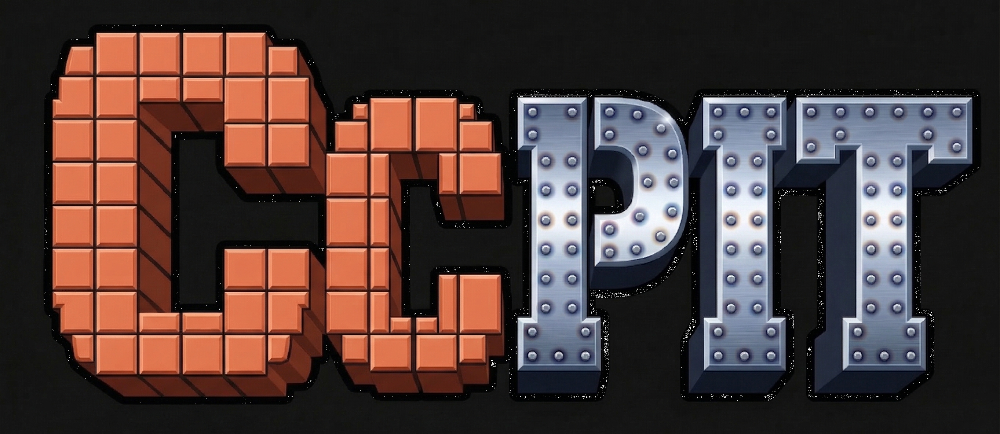
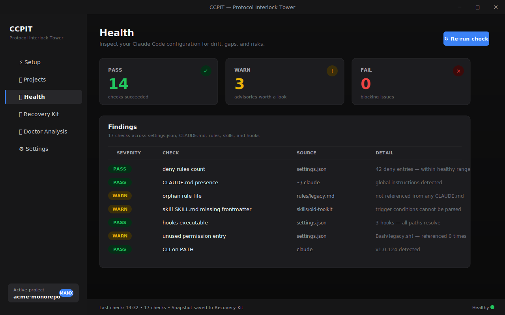
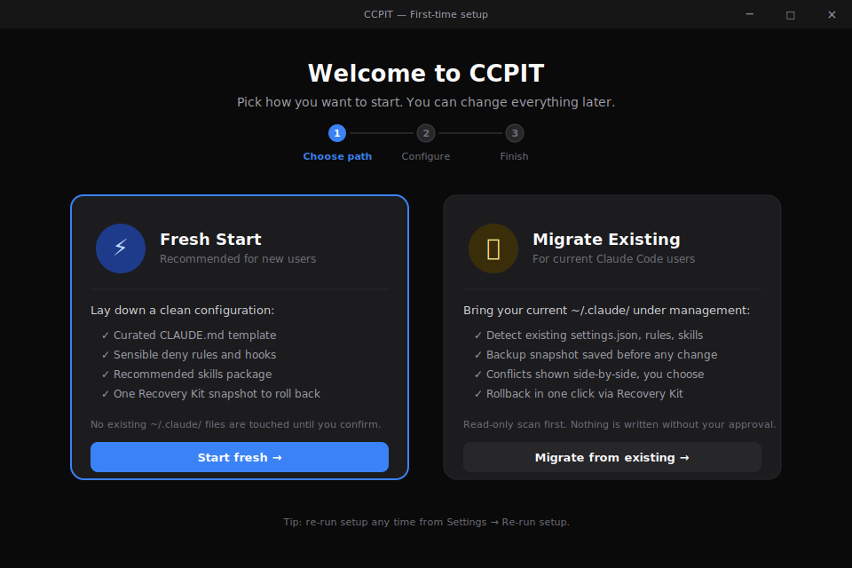
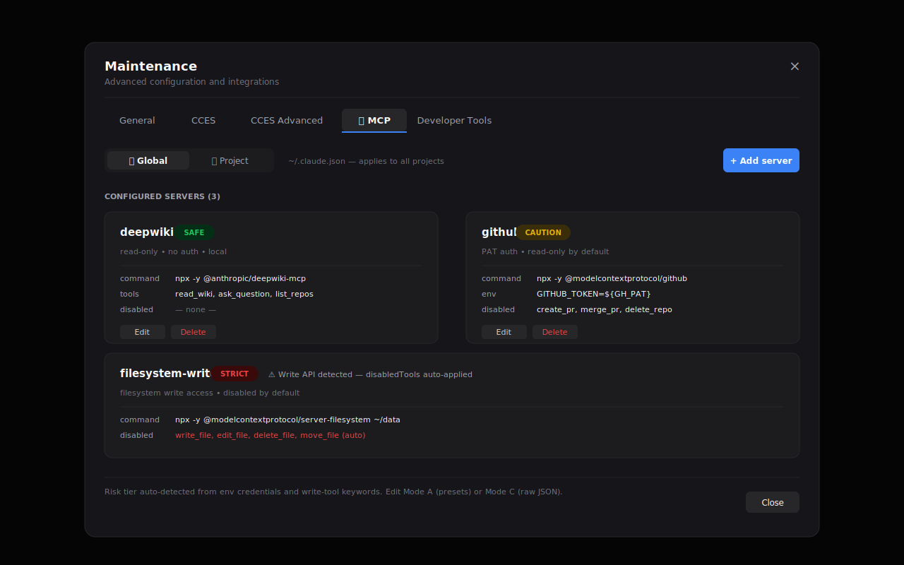

<p align="center">
  
</p>

# CCPIT — Protocol Interlock Tower

> 🇯🇵 **[日本語版 README はこちら / Japanese README](./README.ja.md)**

[](./package.json)
[](./LICENSE)
[](https://www.electronjs.org/)
[](#quick-start)
[](#concept)

**A desktop control panel for your Claude Code configuration.**
Inspect, repair, share, and govern everything under `~/.claude/` — without ever opening JSON by hand.



---

## Why CCPIT?

If you have used Claude Code for more than a few weeks, you probably recognise this:

| Pain you know | What CCPIT does about it |
|---|---|
| `~/.claude/settings.json` keeps growing — you no longer remember which `deny` rule mattered. | Health tab counts deny entries, surfaces orphaned permissions, and tells you what is actually referenced. |
| You added a hook, a skill, and a CLAUDE.md rule — somewhere they conflict. | Health + Doctor Analysis cross-check rules, skills, hooks, and CLAUDE.md frontmatter for drift. |
| You broke something and want yesterday's setup back. | Recovery Kit takes named snapshots and restores them in one click. |
| You wired up an MCP server with a write API and now you are nervous. | MCP tab classifies every server as Safe / Caution / Strict and disables write tools by default. |
| You want your team to use the same Claude Code setup. | Golden Bundle exports your config as a password-protected `.pit` file your teammates can import. |
| You constantly switch between Claude Code projects and forget which is which. | Projects auto-detects every CC project on disk and tags it with its protocol (MANX / ASAMA / Macau / Legacy). |

CCPIT is not a wrapper around Claude Code — it sits next to it and manages the configuration surface so you can spend your time on the actual work.

---

## Features

### Setup & onboarding



A first-run wizard with two paths:

- **Fresh Start** — lays down a curated `CLAUDE.md`, sensible deny rules, recommended skills, and a Recovery Kit snapshot to roll back to.
- **Migrate Existing** — read-only scan of your current `~/.claude/`, then a side-by-side diff before anything is written. Nothing changes until you confirm.

Re-runnable from Settings any time.

### Health & diagnostics

- **Health** — runs ~17 checks across `settings.json`, `CLAUDE.md`, `rules/`, `skills/`, and `hooks/`. Counts pass / warn / fail and shows the offending entries inline.
- **Doctor Analysis** — produces a "doctor pack" you can attach to a bug report or feed back to Claude when something is misbehaving.
- **CLI presence detection** — verifies that `claude` is on `PATH` and reports the version.

### Project management

- **DetectLink** — scans your disk for Claude Code projects and lists them with protocol badges (MANX / ASAMA / Macau / Legacy).
- **Favorites** — pin the projects you actually work on.
- **Protocol history** — see which protocol revisions a project has been through.
- **CC Launch Button** — open Claude Code in the right project directory in one click.
- **CC Request Inbox** — when Claude Code wants to change your settings, it drops a request here. You approve or reject from a GUI instead of editing JSON.

### Configuration & distribution

- **CCES (Claude Code Extensions Summary)** — exports your current setup as a Markdown snapshot you can paste into a new conversation, share with a teammate, or commit to a repo.
- **Recovery Kit** — named snapshots of your entire `~/.claude/` directory. Restore any past state in one click.
- **Golden Bundle** — package your settings, rules, and skills into a password-protected `.pit` archive. Distribute to your team; they import it through the same UI.
- **i18n** — full English and Japanese UI.

### MCP server management ★

The newest addition, designed for teams who are starting to wire up MCP servers but worry about giving the model write access by accident.

| Capability | What it gives you |
|---|---|
| **Two scopes** | Edit both global `~/.claude.json` and per-project `.mcp.json` from one tab. |
| **Mode A — managed** | Pick a preset (DeepWiki / GitHub / etc.), the right tools are enabled, write APIs are disabled by default. |
| **Mode C — raw JSON** | Full JSON editor with syntax highlighting (CodeMirror). For when you want exactly what you want. |
| **Risk badge** | Every server is auto-tagged Safe (green), Caution (yellow), or Strict (red) based on env credentials and write-tool keywords. |
| **PAT guard** | The env field validates `${VAR_NAME}` form and blocks raw token strings before you save. |
| **CLI absence handling** | If the `claude` CLI is missing, write operations are disabled across the whole UI with a banner explaining why. |



---

## Quick start

> CCPIT does not yet ship a packaged installer. Today the primary way to run it is from source. A signed Windows installer is on the roadmap.

### Run from source

Prerequisites: Node.js 20+, npm, Git, and the `claude` CLI on your `PATH`.

```bash
git clone https://github.com/VTRiot/ccpit-win.git
cd ccpit-win
npm install
npm run dev
```

The app launches and walks you through the Setup wizard. If you already have a `~/.claude/` directory, choose **Migrate Existing** — the wizard scans read-only first and a snapshot is taken before anything is written.

### Build a Windows binary

```bash
npm run build:win
```

The unpacked app appears under `dist/`.

### Other commands

```bash
npm run typecheck   # TypeScript check (Node + Web projects)
npm run lint        # ESLint
npm test            # Vitest
```

---

## Architecture

CCPIT is an Electron app:

- **Main process** (`src/main/`) — file system, CLI calls, configuration parsing.
- **Preload** (`src/preload/`) — typed IPC bridge.
- **Renderer** (`src/renderer/`) — React 19 + Tailwind 4 + shadcn-style components, i18n via i18next.

Configuration files always live where Claude Code expects them (`~/.claude/`, `~/.claude.json`, `{project}/.mcp.json`). CCPIT reads, validates, and writes those files in place — there is no second source of truth.

Risky writes (deletes, MCP server changes) go through the same `claude` CLI you would have used by hand, so behaviour matches CLI semantics exactly. CLI-unsupported edits (e.g. `disabledTools`) write the JSON file directly with a snapshot taken first.

---

## Concept

CCPIT is built around a two-layer AI development pattern:

- A **design-side AI** in a chat tool drafts requirements, instructions, and review prompts.
- An **implementation-side AI** (Claude Code) executes against those instructions in the real repository.

That split needs governance: which rules are in force, which skills are loaded, what is allowed to write, what is not. CCPIT exists to make that governance visible and editable instead of buried in JSON. The `MANX Protocol` mentioned in the badges above is the discipline the project itself is built under — see [`docs/ai-guides/`](./docs/ai-guides) for the public materials.

You do not need to adopt any of this to use CCPIT. If you just want a way to keep Claude Code's settings sane, the Health and Recovery Kit tabs alone are worth it.

---

## Roadmap (current state)

What is in the box today:

- Setup wizard (Fresh / Migrate)
- Projects discovery + favorites + protocol badges
- Health + Doctor Analysis
- Recovery Kit
- CCES export
- Golden Bundle (`.pit`) import / export
- CC Request Inbox
- MCP server management (Modes A and C, two scopes, risk badges)
- English / Japanese UI

Areas under active design (not yet shipped, intentionally not promised by date):

- Packaged Windows installer
- macOS / Linux builds
- Additional MCP authoring modes
- Audit log for configuration changes

---

## Built with

- [Electron](https://www.electronjs.org/) 39 + [electron-vite](https://electron-vite.org/)
- [React](https://react.dev/) 19, [TypeScript](https://www.typescriptlang.org/) 5.9
- [Tailwind CSS](https://tailwindcss.com/) 4 + shadcn-style UI primitives ([Radix](https://www.radix-ui.com/))
- [i18next](https://www.i18next.com/) (English / Japanese)
- [CodeMirror](https://codemirror.net/) (MCP raw JSON editor)
- [adm-zip](https://github.com/cthackers/adm-zip) (Golden Bundle `.pit` archive)
- [lucide-react](https://lucide.dev/) icons

---

## Debug Toolkit (built-in skill)

CCPIT ships with a Claude Code skill called `debug-toolkit` under `golden/common/`. It is a symptom-indexed catalogue of known failure modes for the app, written in Failure Mode Analysis form. When you debug CCPIT itself with Claude Code, the skill activates on bug-shaped observations and offers cause candidates, verification steps, and prescriptive caveats per failure mode. It is intentionally a growing toolbox — contributions are welcome.

- Japanese (canonical): `golden/common/ja/skills/debug-toolkit/SKILL.md`
- English: `golden/common/en/skills/debug-toolkit/SKILL.md`

---

## Contributing

Issues and pull requests are welcome. Before sending a PR, please:

1. Run `npm run typecheck && npm run lint && npm test`.
2. Keep changes scoped — one concern per PR.
3. If you touch governance-relevant areas (settings, hooks, deny rules), include a Recovery Kit snapshot strategy in the PR description.

---

## License

MIT. See [LICENSE](./LICENSE).

---

<details>
<summary>Crew</summary>

<br>


</details>
