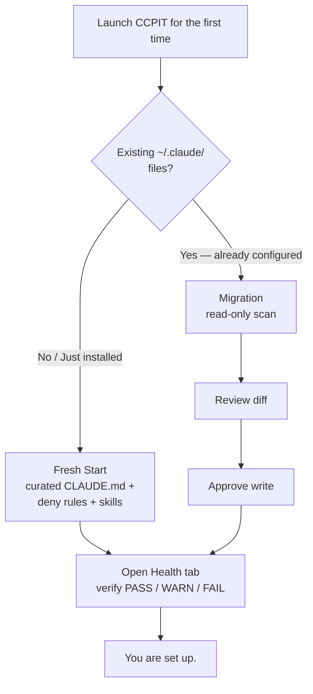

<p align="center">
  
</p>

# CCPIT — Protocol Interlock Tower

> 🇯🇵 **[日本語版 README はこちら / Japanese README](./README.ja.md)**

[](./package.json)
[](./LICENSE)
[](https://www.electronjs.org/)
[](#quick-start)
[](#concept)

**A desktop control panel for your Claude Code configuration.**
Inspect, repair, share, and govern everything under `~/.claude/` — without ever opening JSON by hand.


---

## Why CCPIT?

If you have used Claude Code for more than a few weeks, you probably recognise this:

| Pain you know | What CCPIT does about it |
|---|---|
| `~/.claude/settings.json` keeps growing — you no longer remember which `deny` rule mattered. | Health tab counts deny entries, surfaces orphaned permissions, and tells you what is actually referenced. |
| You added a hook, a skill, and a CLAUDE.md rule — somewhere they conflict. | Health + Doctor Analysis cross-check rules, skills, hooks, and CLAUDE.md frontmatter for drift. |
| You broke something and want yesterday's setup back. | Recovery Kit takes named snapshots and restores them in one click. |
| You wired up an MCP server with a write API and now you are nervous. | MCP tab classifies every server as Safe / Caution / Strict and disables write tools by default. |
| You want your team to use the same Claude Code setup. | Golden Bundle exports your config as a password-protected `.pit` file your teammates can import. |
| You constantly switch between Claude Code projects and forget which is which. | Projects auto-detects every CC project on disk and tags it with its protocol (MANX / ASAMA / Macau / Legacy). |

CCPIT is not a wrapper around Claude Code — it sits next to it and manages the configuration surface so you can spend your time on the actual work.

---

## 🤖 Don't read the manual — ask it

> **"I barely understand any of this, let alone how to use it."** That is the expected starting point. Hooks, skills, deny rules, golden bundles — these are easier to *ask about* than to read about. Spend ~3 minutes turning this repository into your personal CCPIT assistant on Claude.ai, then keep it open and ask it anything — in English or Japanese — while you click around the app.

1. Open <https://claude.ai> and create a new **Project** (any name — *CCPIT Help* works).
2. Add this repository to the Project's knowledge: the simplest path is the GitHub integration pointed at <https://github.com/VTRiot/ccpit-win>; otherwise upload `README.md`, `README.ja.md`, `docs/help-prompt.md`, and the contents of `docs/ai-guides/`.
3. Paste the system prompt from [`docs/help-prompt.md`](./docs/help-prompt.md) into the Project's **Custom Instructions**.

That's it — an interactive guide that answers strictly from this repository's documentation, so it stays honest about what CCPIT does and does not do. Good first questions:

| Ask it… | It will… |
|---|---|
| *"I just installed Claude Code. Fresh Start or Migration?"* | Walk you through the choice using the actual Setup criteria. |
| *"Health shows a WARN on `hooks/` — what now?"* | Explain what that check means and the one-click fix path. |
| *"What is a skill proposal, and why is my CC writing them?"* | Explain the proposal loop (Tour 2 below) in plain words. |
| *"チームに同じ設定を配りたい"* | Answer in Japanese — Golden Bundle export → import, step by step. |

Stuck on any screen later? Paste what you see into that chat and ask.

---

## Getting started — for first-time users

If you have just heard about CCPIT and want to give it a try, this section walks you through the very first run. You do not need to understand `~/.claude/`, hooks, or skills upfront — CCPIT surfaces them as you go, and every write is preceded by a Recovery Kit snapshot you can roll back to.

### Three steps from zero to a working setup

1. **Install and launch.** Download the latest `CCPIT-Setup-x.y.z.exe` from [Releases](https://github.com/VTRiot/ccpit-win/releases), run the installer, then double-click the **CCPIT** desktop shortcut (or launch from the Start menu). The app opens straight into the Setup screen. Prefer running from source? See [Quick start](#quick-start) below.
2. **Pick your starting point.** The Setup welcome screen asks one question — *do you already have Claude Code config files (CLAUDE.md, rules/, etc.)?*
   - **No / I just installed Claude Code** → choose **Fresh Start**. CCPIT lays down a curated `CLAUDE.md`, sensible deny rules, recommended skills, and an initial Recovery Kit snapshot.
   - **Yes / I already configured Claude Code by hand** → choose **Migration**. CCPIT does a *read-only* scan first, shows you a side-by-side diff, and writes nothing until you confirm.
3. **Verify with Health.** Once Setup finishes, open the Health tab inside the Maintenance dialog. You want a row of green checks across `settings.json`, `CLAUDE.md`, `rules/`, `skills/`, and `hooks/`. Anything that is not green has an inline explanation and, where applicable, a one-click fix.


```mermaid
flowchart TD
    A[Launch CCPIT for the first time] --> B{Existing ~/.claude/<br/>files?}
    B -->|No / Just installed| C[Fresh Start<br/>curated CLAUDE.md +<br/>deny rules + skills]
    B -->|Yes — already configured| D[Migration<br/>read-only scan]
    D --> E[Review diff]
    E --> F[Approve write]
    C --> G[Open Health tab<br/>verify PASS / WARN / FAIL]
    F --> G
    G --> H[You are set up.]
```

### Stuck?

Ask your chatbot — see **🤖 Don't read the manual — ask it** right after *Why CCPIT?* (3-minute setup). Then come back and run the two tours below.

---

## Learn by doing — two 5-minute tours

You do not need to understand the machinery first. Run these two tours once and the two most CCPIT-ish loops — **AI-written reports you review in a browser** and **skills your CC proposes by itself** — will make sense from muscle memory.

### Tour 1 — Review your AI's report in HTML (the comment → reply loop)

What you get: instead of scrolling a wall of chat text, your CC hands you a **self-contained HTML report** you read like a document — and your review comments flow back to the CC as ready-made prompts.

1. Finish any piece of work in Claude Code, then ask it: *"Write the report as Markdown and render it to HTML with the `md-render` skill."* (The skill ships in CCPIT's golden payload — the CC picks it up on its own.)
2. Open the generated `.html` (it sits next to the `.md`) in your browser. Everything is offline and deterministic — no server, no build step.
3. Click around: the **Day/Dark** toggle, **H2 section tabs**, the **conclusion-summary panel** hoisted to the top with OK / FAIL / CAVEAT badges, hover tooltips on proper nouns.
4. Scroll to any section and type into its **comment box**. Notes persist in `localStorage` — they survive a reload.
5. Click **generate reply prompt + copy** on that section: you get a paste-ready prompt carrying your comment *and* its section context. Paste it into your CC session.
6. When the CC has addressed it, close the thread with the **resolved badge**. Repeat until the report is clean.

The `--verify` mode guarantees the HTML says exactly what the Markdown says (HTML ⊆ MD and MD ⊆ HTML, fail-closed) — you review the render, but you are reviewing the source.

### Tour 2 — Let your CC propose its own skills (the SkillProposal loop)

What you get: your Claude Code sessions stop being disposable. At the end of a session the CC distills what worked into a **skill proposal**; you adopt the good ones with one password — and the next session already knows the trick.

1. Work a normal Claude Code session (installed via Fresh Start / golden bundle, the loop is already wired). When the session ends, a Stop hook nudges the CC once: *"any workflow worth keeping?"* You do nothing — the CC writes a proposal (or an explicit "no candidate") to `~/.ccpit/proposals/`.
2. Open CCPIT → **Skill candidates** in the sidebar — the skill candidate browser. Every proposal is a card: title, What / Why / How, a **recommend / reject** label the CC gave itself, 5-axis self-scores, and the project it came from.
3. Pick a *recommended* card. The **review gate** shows the reviewer box — independent review findings land there before you decide.
4. Enter your password → **Adopt**. CCPIT snapshots first, validates, and rolls back automatically on failure. The skill lands in `~/.claude/skills/`.
5. Next session: when its trigger matches, the skill fires. Rejected proposals keep their reasoning — nothing is silently lost, and you remain the only gate that can make anything permanent.

---

## Features

### Setup & onboarding


A first-run wizard with two paths:

- **Fresh Start** — lays down a curated `CLAUDE.md`, sensible deny rules, recommended skills, and a Recovery Kit snapshot to roll back to.
- **Migrate Existing** — read-only scan of your current `~/.claude/`, then a side-by-side diff before anything is written. Nothing changes until you confirm.

Re-runnable from Settings any time.

### Health & diagnostics

- **Health** — runs a battery of checks across `settings.json` (deny coverage & symmetry, hook registration coverage **and liveness** — non-firing registrations are reported, not shown green), `CLAUDE.md`, `rules/`, `skills/`, and `hooks/`. Counts pass / warn / info / fail and shows the offending entries inline. Since v1.6.0, a user-customized `CLAUDE.md` is reported as informational — customizing it is normal use — while a missing or empty `CLAUDE.md` is an error.
- **Doctor Analysis** — produces a "doctor pack" you can attach to a bug report or feed back to Claude when something is misbehaving.
- **CLI presence detection** — verifies that `claude` is on `PATH` and reports the version.

### Project management


- **DetectLink** — scans your disk for Claude Code projects and lists them with protocol badges (MANX / ASAMA / Macau / Legacy).
- **Favorites** — pin the projects you actually work on.
- **Protocol history** — see which protocol revisions a project has been through.
- **CC Launch Button** — open Claude Code in the right project directory in one click.
- **CC Request Inbox** — when Claude Code wants to change your settings, it drops a request here. You approve or reject from a GUI instead of editing JSON.

### Configuration & distribution

- **CCES (Claude Code Extensions Summary)** — exports your current setup as a Markdown snapshot you can paste into a new conversation, share with a teammate, or commit to a repo.
- **Recovery Kit** — named snapshots of your entire `~/.claude/` directory. Restore any past state in one click.
- **Golden Bundle** — package your settings, rules, and skills into a password-protected `.pit` archive. Distribute to your team; they import it through the same UI.
- **i18n** — full English and Japanese UI.

### Skill proposal loop


- **Sensing** — a Stop hook has the CC distill each session into a skill proposal (or an explicit "no candidate") under `~/.ccpit/proposals/`.
- **Skill candidate browser** — proposals as cards: What / Why / How, self-assigned recommend / reject labels, 5-axis scores, origin project.
- **Review gate + one-click adopt** — independent review findings surface next to the card; adoption is password-gated with snapshot / validate / auto-rollback.
- Hands-on walkthrough: **Tour 2** above.

### Enforcement stats


Governance you cannot observe is governance you have to take on faith. The **Enforcement stats** page (read-only) computes, from your local Claude Code session transcripts, how often each layer of governance actually fired:

- **skill** — which skills activated, ranked, with a per-project breakdown on hover.
- **hooks (Stop)** — Stop-hook cycles, ranked per hook script.
- **rules layer B** — rule firings that actually blocked a Stop.
- **deny** — permission denials, shown as two distinct series: `settings.json` deny hits and rule/policy self-denials.
- **marshal-review** — independent review launches.

Every tab states its measurement limits in a banner up front — what cannot be measured is declared as unmeasurable instead of being padded with fabricated numbers. Nothing is written: the page only reads transcripts.

### MCP server management ★

The newest addition, designed for teams who are starting to wire up MCP servers but worry about giving the model write access by accident.

| Capability | What it gives you |
|---|---|
| **Two scopes** | Edit both global `~/.claude.json` and per-project `.mcp.json` from one tab. |
| **Mode A — managed** | Pick a preset (DeepWiki / GitHub / etc.), the right tools are enabled, write APIs are disabled by default. |
| **Mode C — raw JSON** | Full JSON editor with syntax highlighting (CodeMirror). For when you want exactly what you want. |
| **Risk badge** | Every server is auto-tagged Safe (green), Caution (yellow), or Strict (red) based on env credentials and write-tool keywords. |
| **PAT guard** | The env field validates `${VAR_NAME}` form and blocks raw token strings before you save. |
| **CLI absence handling** | If the `claude` CLI is missing, write operations are disabled across the whole UI with a banner explaining why. |


---

## Quick start

### Requirements

| Requirement | Why |
|---|---|
| **Windows 10 / 11 (64-bit)** | The packaged installer targets Windows. macOS / Linux are source-build only and not yet supported targets. |
| **Git for Windows** or **scoop Git** (`bash.exe`) | CCPIT's governance hooks run as bash scripts. Since v1.6.0, golden deploy resolves your local Git Bash and writes its absolute path into the hook registrations — and **stops with guidance instead of deploying hooks that would never fire** if no Git Bash is found (fail-closed). |
| **Claude Code CLI** (`claude` on `PATH`) | Needed for CC launch buttons, MCP write operations, and CLI-backed edits. The rest of the UI works without it (a banner explains what is disabled). |

### Install from a packaged installer (recommended)

1. Download `CCPIT-Setup-x.y.z.exe` from [Releases](https://github.com/VTRiot/ccpit-win/releases).
2. **Windows SmartScreen will warn you on first run — this is expected.** The installer is currently **not code-signed** (signing is planned alongside incorporation). When the blue "Windows protected your PC" dialog appears, click **More info → Run anyway**. If you want to be sure of what you are running, compare the installer's SHA-256 against the checksum published on the Release page (`certutil -hashfile CCPIT-Setup-x.y.z.exe SHA256`).
3. Run the installer (the wizard supports per-user install and lets you pick the install directory). Desktop / Start menu shortcuts are created by default.
4. Launch via the **CCPIT** desktop shortcut or Start menu entry.

### Run from source

Prerequisites: Node.js 20+, npm, Git, and the `claude` CLI on your `PATH`.

```bash
git clone https://github.com/VTRiot/ccpit-win.git
cd ccpit-win
npm install
npm run dev
```

The app launches and walks you through the Setup wizard. If you already have a `~/.claude/` directory, choose **Migrate Existing** — the wizard scans read-only first and a snapshot is taken before anything is written.

### Build a Windows binary

```bash
npm run build:win
```

The unpacked app appears under `dist/`.

### Other commands

```bash
npm run typecheck   # TypeScript check (Node + Web projects)
npm run lint        # ESLint
npm test            # Vitest
```

---

## Architecture

CCPIT is an Electron app:

- **Main process** (`src/main/`) — file system, CLI calls, configuration parsing.
- **Preload** (`src/preload/`) — typed IPC bridge.
- **Renderer** (`src/renderer/`) — React 19 + Tailwind 4 + shadcn-style components, i18n via i18next.

Configuration files always live where Claude Code expects them (`~/.claude/`, `~/.claude.json`, `{project}/.mcp.json`). CCPIT reads, validates, and writes those files in place — there is no second source of truth.

Risky writes (deletes, MCP server changes) go through the same `claude` CLI you would have used by hand, so behaviour matches CLI semantics exactly. CLI-unsupported edits (e.g. `disabledTools`) write the JSON file directly with a snapshot taken first.

---

## Security & privacy — what CCPIT reads and writes

A tool that edits your Claude Code configuration should tell you exactly where its hands go. This is the complete surface:

| Path | Read | Write | Notes |
|---|---|---|---|
| `~/.claude/settings.json` | ✅ | ✅ | Health checks; golden deploy rewrites it **after backing up the existing file** (`*.bak.<timestamp>`). Deploy also injects the absolute path of your local Git Bash into hook registrations. |
| `~/.claude/CLAUDE.md`, `rules/`, `skills/`, `hooks/` | ✅ | ✅ | Golden deploy / migration / skill adoption. Every overwrite is preceded by a backup or Recovery Kit snapshot. |
| `~/.claude.json`, `{project}/.mcp.json` | ✅ | ✅ | MCP tab, both scopes. CLI-backed where the CLI supports the edit. |
| `~/.ccpit/` | ✅ | ✅ | CCPIT's own state: `app-config.json`, `projects.json`, `snapshots/` (Recovery Kit), `proposals/` (skill proposals from your CC sessions), review records, CC change requests. |
| Your project directories | ✅ | — | Read-only scanning for project discovery (DetectLink) and protocol badges. |

Things you should know, stated plainly:

- **No telemetry, no network calls.** The app makes no HTTP requests of its own — everything runs against your local files. (External links in the UI open your browser; MCP servers you configure are executed by Claude Code, not by CCPIT.)
- **The adoption/deploy password is stored locally** in `settings.json` (`auth.password`) and checked by the settings-guard hook. It is a governance gate against casual/unattended edits — not encryption. Anyone with full access to your user profile can read it.
- **Hooks are bash scripts** installed under `~/.claude/hooks/` and registered in `settings.json`. Claude Code (not CCPIT) executes them at session events (Stop / PreToolUse / SessionStart). You can read every script before deploying — they are plain text in this repository under `golden/common/hooks/`.
- **Destructive operations snapshot first.** Golden deploy, migration, and skill adoption all take a backup / Recovery Kit snapshot before writing, and adoption rolls back automatically on validation failure.

---

## Concept

CCPIT is built around a two-layer AI development pattern:

- A **design-side AI** in a chat tool drafts requirements, instructions, and review prompts.
- An **implementation-side AI** (Claude Code) executes against those instructions in the real repository.

That split needs governance: which rules are in force, which skills are loaded, what is allowed to write, what is not. CCPIT exists to make that governance visible and editable instead of buried in JSON. The `MANX Protocol` mentioned in the badges above is the discipline the project itself is built under — see [`docs/ai-guides/`](./docs/ai-guides) for the public materials.

You do not need to adopt any of this to use CCPIT. If you just want a way to keep Claude Code's settings sane, the Health and Recovery Kit tabs alone are worth it.

---

## Roadmap (current state)

What is in the box today:

- Setup wizard (Fresh / Migrate)
- Projects discovery + favorites + protocol badges
- Health + Doctor Analysis
- Recovery Kit
- CCES export
- Golden Bundle (`.pit`) import / export
- CC Request Inbox
- MCP server management (Modes A and C, two scopes, risk badges)
- Skill proposal loop (Stop-hook sensing → candidate browser → password-gated adoption)
- Enforcement stats (read-only firing statistics: skills / Stop hooks / rule blocks / deny hits / review launches)
- Report HTML renderer skill (`md-render`: dark theme, tabs, per-section comments, `--verify`)
- Bulk CC restart (generation-flag based, confirmation preview)
- Per-session CC identity (surfaced in exported summaries)
- English / Japanese UI
- Packaged Windows installer (NSIS; currently unsigned — see the SmartScreen note in Quick start)

Areas under active design (not yet shipped, intentionally not promised by date):

- macOS / Linux builds
- Additional MCP authoring modes
- Audit log for configuration changes

---

## Known issues (v1.6.0)

Stated up front rather than discovered the hard way:

- **Unsigned installer** — Windows SmartScreen shows a warning on first run. Workaround in [Quick start](#quick-start); code signing is planned alongside incorporation.
- **Git Bash is a hard requirement for hooks** — golden deploy intentionally refuses to run when no Git Bash (`bash.exe`) can be resolved from scoop Git or Git for Windows, because the hooks it would register could never fire. Install one of the two, then re-run deploy.
- **Upgrading from an older deploy?** Health may report your existing hook registrations after upgrading:
  - *"unquoted legacy"* informational note (green) — your hooks work, but re-running golden deploy migrates them to the new quoted form that also survives home paths containing spaces.
  - On a home path **containing spaces**, old unquoted registrations are reported as an **error** — this is a true positive: those hooks were silently not firing. Re-run deploy to fix.
  - Registrations pointing at the WSL launcher (`C:\Windows\System32\bash.exe`) or a bare `bash` are flagged as non-firing. Re-run deploy.
- **Windows-only packaged build** — macOS / Linux are source-build only and not yet tested targets.

---

## Built with

- [Electron](https://www.electronjs.org/) 39 + [electron-vite](https://electron-vite.org/)
- [React](https://react.dev/) 19, [TypeScript](https://www.typescriptlang.org/) 5.9
- [Tailwind CSS](https://tailwindcss.com/) 4 + shadcn-style UI primitives ([Radix](https://www.radix-ui.com/))
- [i18next](https://www.i18next.com/) (English / Japanese)
- [CodeMirror](https://codemirror.net/) (MCP raw JSON editor)
- [adm-zip](https://github.com/cthackers/adm-zip) (Golden Bundle `.pit` archive)
- [lucide-react](https://lucide.dev/) icons

---

## Debug Toolkit (built-in skill)

CCPIT ships with a Claude Code skill called `debug-toolkit` under `golden/common/`. It is a symptom-indexed catalogue of known failure modes for the app, written in Failure Mode Analysis form. When you debug CCPIT itself with Claude Code, the skill activates on bug-shaped observations and offers cause candidates, verification steps, and prescriptive caveats per failure mode. It is intentionally a growing toolbox — contributions are welcome.

- Japanese (canonical): `golden/common/ja/skills/debug-toolkit/SKILL.md`
- English: `golden/common/en/skills/debug-toolkit/SKILL.md`

---

## Report rendering (built-in skill) ★ new in v1.6.0

CCPIT ships a Claude Code skill called `md-render` under `golden/common/`. It turns a report Markdown file into a deterministic, self-contained HTML document — no network, no build step. New in v1.6.0:

- **Dark theme** with value-dependent gradient bars for at-a-glance metrics.
- **H2 section tabs** — long reports become navigable tabs instead of one endless scroll.
- **Per-section comments** persisted in `localStorage`, so your review notes survive a reload.
- **One-click reply-prompt generation + copy** — turn any section into a ready-to-paste follow-up prompt.
- **Inline diagrams** — Mermaid (vendored, offline) and value-driven bar figures.
- **sha1 heading anchors** for stable deep links, plus a bidirectional `--verify` (HTML ⊆ MD and MD ⊆ HTML) that fails closed when the HTML and its source drift apart.

- Japanese (canonical): `golden/common/ja/skills/md-render/SKILL.md`
- English: `golden/common/en/skills/md-render/SKILL.md`
- Hands-on walkthrough: **Tour 1** in *Learn by doing* above.

---

## Contributing

Issues and pull requests are welcome. Before sending a PR, please:

1. Run `npm run typecheck && npm run lint && npm test`.
2. Keep changes scoped — one concern per PR.
3. If you touch governance-relevant areas (settings, hooks, deny rules), include a Recovery Kit snapshot strategy in the PR description.

---

## License

MIT. See [LICENSE](./LICENSE).

---

<details>
<summary>Crew</summary>

<br>


</details>
