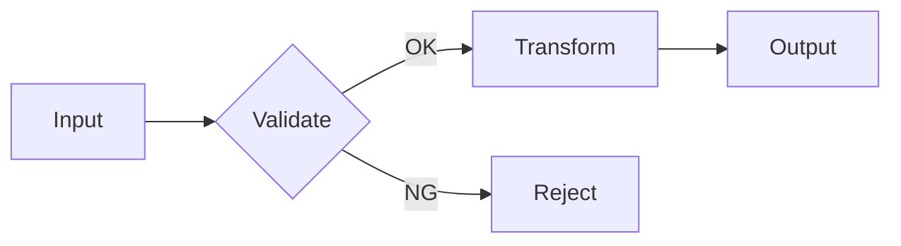

# Template: procedure flow (flow)

Use: procedures/processing order/root-cause analysis with 3+ steps or branching.
Rules: ≤7 nodes (max 10) / ≤3 branches / ≤4 levels / edge labels only for branch conditions /
time & procedure = LR, hierarchy & causes = TD / one-sentence conclusion right before the figure.

How to write (copy and adapt):

````text
Processing proceeds in 3 stages with validation in between.


````

If you exceed 8 nodes, split into an overview map + a detail flow.

Frontmatter declaration: `figures: [flow]`
