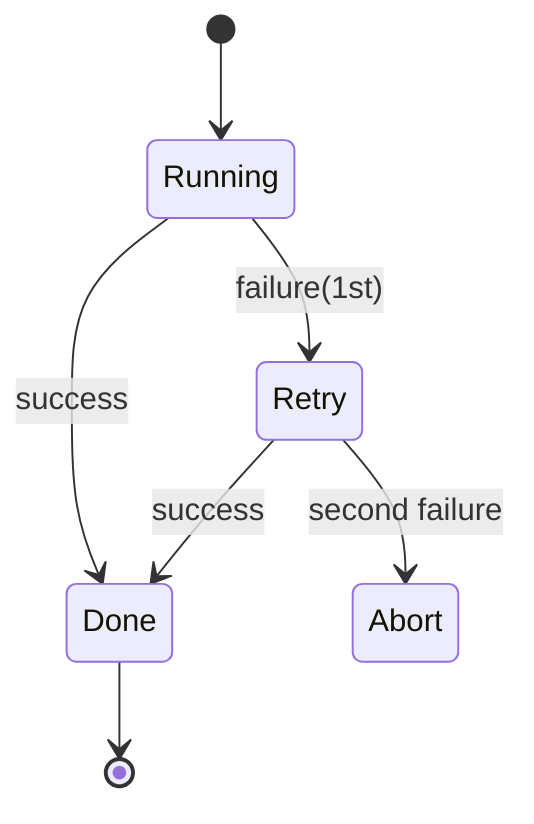

# Template: state transitions (state)

Use: 3+ states with retry/failure/rollback loops (do not force cycles into a flowchart).
Rules: ≤6 states / ≤8 transitions / exception paths only when decision-relevant / one-sentence conclusion right before the figure.

How to write (copy and adapt):

````text
On failure it retries exactly once; a second failure drops to abort.


````

Frontmatter declaration: `figures: [state]`
