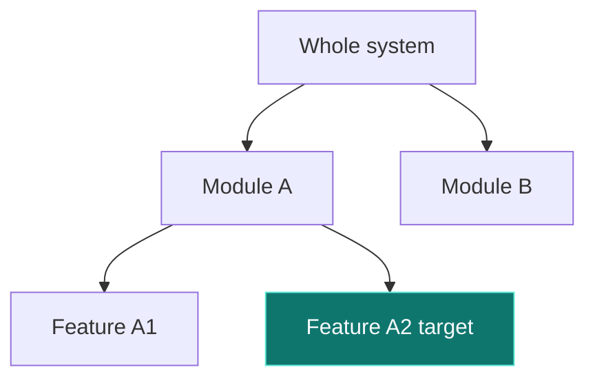

# Template: current-location tree (where-map)

Use: show "you are here" within the system when impact spans 3+ areas.
Rules: ≤7 nodes / exactly 1 highlighted current node / labels ≤18 chars / one-sentence conclusion right before the figure.

How to write (copy and adapt):

````text
The target is feature Y in module X (green below).


````

Frontmatter declaration: `figures: [where-map]`
