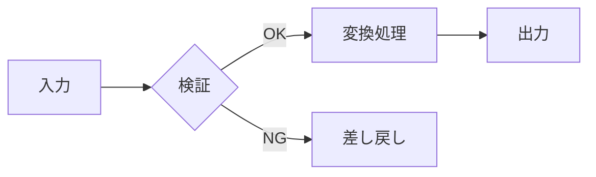

# 雛形: 手順フロー（flow）

用途: 3 ステップ以上 or 分岐ありの手順・処理順・原因分析。
規則: ノード 7 個以内（最大 10）/ 分岐 3 本まで / 深さ 4 階層まで / エッジラベルは条件分岐のみ /
時間・手順は LR（左→右）、階層・原因は TD（上→下）/ 図の直前に結論 1 文。

書き方（コピーして書き換える）:

````text
処理は検証を挟んで 3 段で進む。


````

8 ノードを超えたら「現在地図 + 詳細フロー」の 2 枚に分割する。

frontmatter 宣言: `figures: [flow]`
