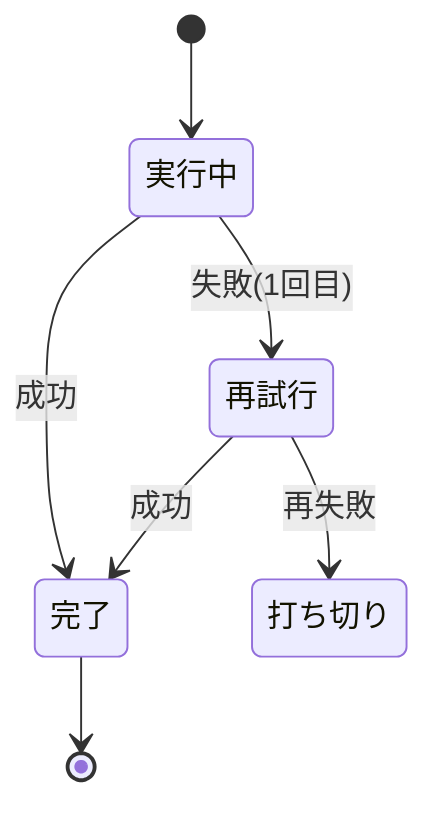

# 雛形: 状態遷移（state）

用途: 状態 3 個以上で、戻り・失敗・再試行・ロールバックがある時（flowchart で循環を無理に描かない）。
規則: 状態 6 個以内 / 遷移 8 本以内 / 例外系は意思決定に関係するものだけ / 図の直前に結論 1 文。

書き方（コピーして書き換える）:

````text
失敗時は 1 回だけ再試行し、再失敗で打ち切りに落ちる。


````

frontmatter 宣言: `figures: [state]`
