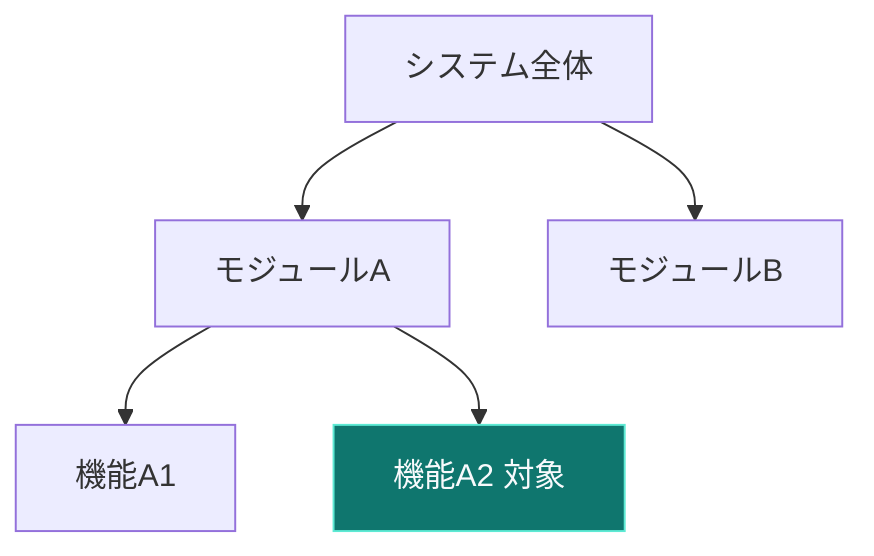

# 雛形: 現在地ツリー（where-map）

用途: 影響範囲が 3 領域以上にまたがる時、システムの中の「今ここ」を示す。
規則: ノード 7 個以内 / 現在地ハイライトは 1 つだけ / ラベル 18 字以内 / 図の直前に結論 1 文。

書き方（コピーして書き換える）:

````text
対象は X モジュールの Y 機能（下図の緑）。


````

frontmatter 宣言: `figures: [where-map]`
